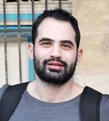

# About Me

## Summary
My nbame is Keenan. I'm a higschool Senior, awrd winning web developer, and a massive nerd. I spend most of my time working on coding projects and playing with legos (mostly maintaining my Imperail Star Destroyer). I'm fairly familair with python, HTML, CSS, Js, React,and have some expericane in c++ and electrical circuits.

## Hobbies
- Coding
- Watching movies
- Reading books about technology
- Legos

Night time routine
1. Shower
2. Brush teeth
3. Set out cloths for the morning
4. Sleep

## My Philosophy
*If it works don't fix it, reuse it!*

## Favorite Quotes
"Appear __weak__ when you are __strong__, and __strong__ when you are __weak__."-Sun Tzu The Art of War

"__You__ can't see __me__"-John Cena

## My Favorite Websites
[My Portfolio](https://koeh1124.github.io/portfolio/)

[Useful stuff](https://theuselessweb.com/)

## Persons of Intrest
[The Doctor][1] 
<kbd>

</kbd> 
[Linus][2] 
<kbd>

</kbd> 
[This Guy][3] 
<kbd>

</kbd> 

##Favorite Terms
| Terms | Why I love these things |
|:-|:-:|
| BoardGames | I love playing with friends and having fun |
| Computers | I love the idea of taking simple instructions and repetting them over and over untill you have extreme complexity |
| Code | I love solving problems and this is the medium I prefer to solove them in |
| Math | I love numbers and computation |
| Science | I love the idea of quantifing nature |
